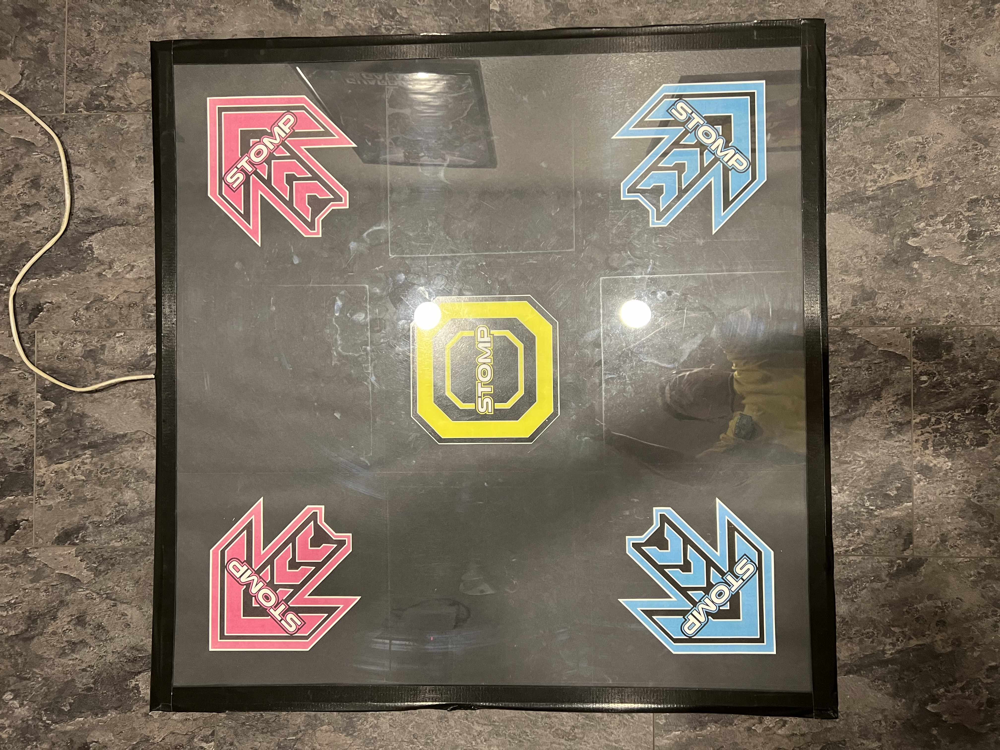

# PIU Dancemats 

I followed the [tutorial]([https://react-icons.github.io/react-icons/search](https://ventspace.wordpress.com/2018/04/09/danceforce-v3-diy-dance-pad-controller/)https://ventspace.wordpress.com/2018/04/09/danceforce-v3-diy-dance-pad-controller/) made by Promit to create two Pump It Up (PIU) style dancemats.

## Overview

The dance mats function by using a simple voltage divider circuit that is measured by analog sensors on the Arduino. Whenever the voltage drops by a predefined threshold, a key press is registered and sent to the computer.

## Materials 

The following were used to fabricate two 3ft x 3ft boards (player 1 and player 2):
* 4x8 1/4" Plywood
* 4x8 1/8" Particle Board
* 4x8 1/4" Lexan Sheet
* 2" Copper Tape (2 rolls)
* 10x [Velostat](https://www.adafruit.com/product/1361) Sheets 11" x 11"
